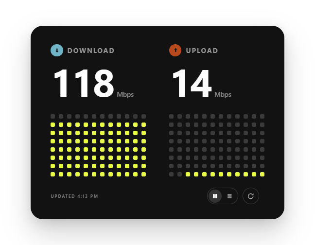
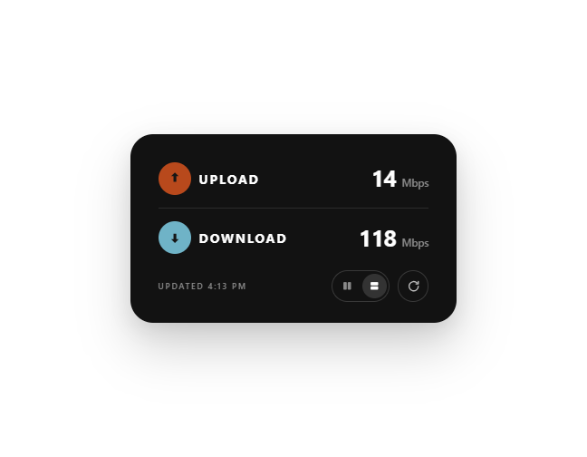

# Internet Speed Meter

A small floating network meter for Windows. It shows live system throughput in the two
directions, keeps a short scrolling history, and can run an on-demand benchmark when you ask
it to. No window border, no title bar, no background panel — just the card on your desktop.

| Expanded | Compact |
| --- | --- |
|  |  |

## Download

Grab the latest build from [Releases](../../releases):

- **`InternetSpeedMeter-Setup-x64.exe`** — installer. Per-user, so it asks for no administrator
  rights; adds an entry in *Add or remove programs* and a Start Menu shortcut.
- **`InternetSpeedMeter-portable-win-x64.zip`** — extract anywhere and run
  `InternetSpeedMeter.exe`. Self-contained: no .NET installation needed.

**Requires** Windows 10 or 11, 64-bit, and the [Evergreen Microsoft Edge WebView2 Runtime][webview2],
which is already present on current Windows 11 installs. The UI is rendered by WebView2.

## Using it

| | |
| --- | --- |
| Drag it | Press and drag anywhere on the card that is not a button |
| Live rates | Update once a second from the OS interface counters; drop to `Kbps` below 1 Mbps |
| Dot grid | The last 12 seconds of traffic per direction, oldest on the left |
| Run a benchmark | Press `↻` — it downloads and uploads against Cloudflare, then reports the sustained rate |
| Switch layout | The pill next to the status line toggles expanded / compact |
| Keep it on top | The pin button left of the layout switcher holds the card above other windows. A small LED lights green when it is on, and the choice is remembered between runs |
| Fade out when left alone | Three seconds after the pointer leaves, the card drops to 55% opacity; move back over it and it returns. Live traffic updates do not count as interaction |
| Close it | `Alt` + `F4`, or exit from the taskbar entry |

The benchmark only ever runs on press. While it runs, and for five seconds afterwards, it owns
the readout; then live traffic resumes.

Command line:

```
InternetSpeedMeter.exe                      expanded layout, 0.6 scale, live traffic on
InternetSpeedMeter.exe --stack              compact layout
InternetSpeedMeter.exe --scale=1            full size (0.35 to 1.5)
InternetSpeedMeter.exe --no-live            benchmark results only, no continuous sampling
```

Leaving live sampling on costs about 1.25% of one core and 16 MB of working set.

## How it is built

WPF hosts a WebView2 control that renders the UI, so the card is HTML/CSS/JS rather than a
re-implementation in XAML. `Assets/speed-meter.html` is a verbatim copy of the design it
recreates and is deliberately never edited; every app-only behaviour (the frameless
transparent window, drag-to-move, non-selecting text, the live readout, the narrower compact
card) is layered on from `Assets/app-shell.js`, which the host injects at document creation.

Traffic comes from the `\Network Interface(*)\Bytes Received|Sent/sec` performance counters,
summed across adapters — see `TrafficSampler.cs`.

```
dotnet build -c Release                                    # debug build
dotnet publish -c Release -r win-x64 --self-contained true \
  -p:PublishSingleFile=true -p:IncludeNativeLibrariesForSelfExtract=true \
  -o publish/portable-win-x64                              # portable
ISCC.exe installer\installer.iss                           # installer -> dist\
```

## Verifying it against the reference

The point of this project is that the app is indistinguishable from the HTML design it
recreates, so the repo carries the harness that proves it rather than asking you to trust a
glance. It drives both the reference page (in a real browser window, so text antialiasing
matches) and the app over CDP, then compares every rectangle and computed style:

```
node tools/verify.mjs all            # geometry, styles, and the layout-transition timing
node tools/verify.mjs onscreen       # pixel-diffs both windows as the desktop paints them
node tools/verify.mjs responsive     # six viewports, including both breakpoints
node tools/livetest.mjs              # live readout, benchmark handover, history scroll
```

It needs the reference HTML, which is not in this repo: copy `tools/paths.local.example.json`
to `tools/paths.local.json` and point `referenceHtml` at it, or set `SM_REFERENCE_HTML`.
`tools/winshot` is a small C# probe used for window geometry, screen grabs, pixel diffs and
synthetic input.

## Acknowledgements

The idea of a network meter as a small self-contained desktop widget — rather than a window
with chrome around it — was inspired by Collect UI's
[Widget UI Design Inspiration](https://collectui.com/designs/widget-ui-design-inspiration/bc972294-314c-4ee0-b817-407061e33ac6)
collection. The card's own visual design comes from the HTML reference described above, not
from that gallery.

## Layout notes

The card's own design — dimensions, corner radius, shadow, typography, spacing, the
expanded/compact transition and its 450 ms `cubic-bezier(.22, 1, .36, 1)` easing — is the
reference's, unmodified. Deliberate departures exist, all declared in `app-shell.js`: the page
backdrop is transparent so the card can float, text does not select, the compact card is 400 px
wide rather than 460 px (horizontal only; no vertical metric changes), a keep-on-top pin button
is inserted left of the layout switcher, and the whole card fades to 55% when idle. The fade is
applied to `<body>` rather than `.card` because the reference's layout transition assigns
`card.style.transition` and would drop it mid-animation. The pin button and the fade together
widen `.tools` by 48 px and shift its left edge; no other reference geometry moves.

[webview2]: https://developer.microsoft.com/microsoft-edge/webview2/
